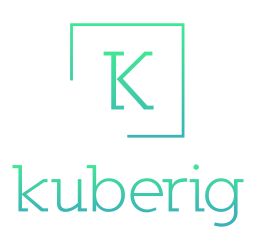

# KubeRig User Manual

KubeRig is an open-source deployment automation tool for Kubernetes/OpenShift focused on making deployments smarter.

In order to make deployments smarter a number of things are important to know about KubeRig.
- KubeRig has environment support.
- KubeRig itself is a [Gradle](https://gradle.org/) plugin.
- Kubernetes resources are defined using [Kotlin](https://kotlinlang.org/) code.
- The KubeRig [Kotlin](https://kotlinlang.org/) DSL provides a powerful base to define your resources in a smarter way.

## Environment Support?
When developing applications there is a natural need to have more then 1 environment where applications can be deployed to. 1 for development, 1 for testing and production. 
The amount of environments and their names vary (a lot).  

Regardless of the amount of different environments, there is a need to maintain a separate set of configuration for each environment.

## Why a Gradle Plugin?
[Gradle](https://gradle.org/) itself is a very powerful build tool. 

Once you dive into [Gradle](https://gradle.org/) plugins you will find that you can build on top of other plugins. And that is exactly why it makes sense for KubeRig. 

For deployments the 'one-size-fits-all' rule does not apply. So when you need it you can start creating your own Gradle plugins and extend your deployment projects to suite your needs.

## Why Kotlin?
[Kotlin](https://kotlinlang.org/) is a safe, concise language that has great DSL support this makes it ideal for defining Kubernetes resources in a smart way.

## Why a DSL?
The KubeRig DSL is generated based on the API specification of a Kubernetes or OpenShift cluster and provides a type-safe base to define your resources. 
This gives you auto-complete and automatic validation on version updates.

A quick example that defines a ConfigMap.
```kotlin
@EnvResource
fun basicConfigMap() : ConfigMapDsl {
    return configMap {
        metadata {
            name("app-config")
        }
        data("app.parameter", "some-value")
    }
}
```

For vanilla Kubernetes and Openshift you can find the supported versions here
- [Kubernetes](https://github.com/kuberig-io/kuberig-dsl-kubernetes)
- [Openshift](https://github.com/kuberig-io/kuberig-dsl-openshift)